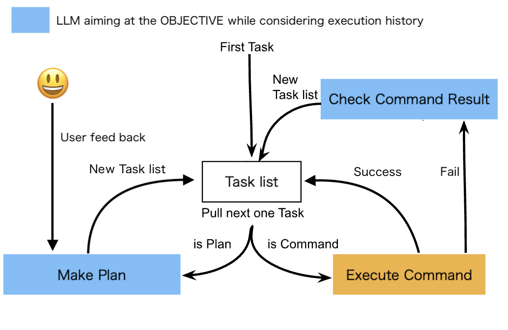

# ⭐️GPT-4 Turboに対応⭐️

# 注意事項

- 意図せず環境を破壊する恐れがあります。基本的にはDockerなどの仮想環境で実行してください。
- 目的を達成できず、ループし続けることがあります。その際にAPIの使用量が多くなることがありますので、責任を持って使用してください
- 基本的にはGPT-4 Turbo以上で検証しているため、GPT-4 Turbo以上の使用を推奨します
(GPT-4-8kを利用する場合は旧バージョンのBabyCommandAGIのv2を使用することを推奨します)

# 目的

BabyCommandAGIはGUIよりも古くからあるコンピューターとの対話インタフェースであるCLIとLLMを組み合わせた時、何が起きるのか検証するためのものです。コンピューターに詳しくない方はご存知無いかもしれませんが、CLIは古くからあるコンピューターとの対話インターフェースです。現在もCLIを通すことで多くのコンピューターの操作ができます(よくあるLinuxサーバーはCLIを主に使用します)。LLMとCLIが会話するのを想像してみてください。何が起きるかワクワクしますよね。是非皆さんも触って新しいユースケースを見つけて頂けると幸いです。

このシステムを動かすにはGPT-4 Turbo以上のAPIを推奨します。

このPythonスクリプトのシステムは[BabyAGI](https://github.com/yoheinakajima/babyagi)をベースにしています。但し、[BabyAGI](https://github.com/yoheinakajima/babyagi)の思考部分だった箇所について効率良くコマンドが実行するためにかなり簡略化してしまっています。(後に変えていくかもしれません)

# ユースケース

BabyCommandAGIは様々なケースで使用できる可能性があります。是非皆さん使ってユースケースを見つけてみてください。

下記にわかっている有用なユースケースが記載しておきます。

## 自動プログラミング

- フィードバックするだけでアプリを自動的に作らせる

https://twitter.com/saten_work/status/1674855573412810753

## 自動環境構築

- コンテナのLinux環境にFlutterをインストールし、Flutterアプリを作成して、Webサーバーを立ち上げ、コンテナ外からアクセスできるようにさせる

https://twitter.com/saten_work/status/1667126272072491009

# 仕組み

このスクリプトは、次のような継続したループを実行することで動作します

1. タスクリストから最初のタスクを取り出す。
2. そのタスクがコマンドタスクか計画タスクかを判別する
3. コマンドタスクの場合:
    1. コマンドを実行
    2. コマンド実行結果がStatus Codeが0かつ応答が無い場合:
        次のタスクへ
    3. それ以外:
        コマンド実行の結果をLLMで分析し、目的が完了しているかチェックし、完了していない場合は新しいタスクリストを作成
4. 計画タスクの場合:
    1. LLMで計画を実行
    2. 実行した計画をLLMで分析し、新しいタスクリストを作成する



# セットアップ

以下の手順を実施してください。

1. ```git clone https://github.com/saten-private/BabyCommandAGI.git```
2. ```cd```でBabyCommandAGIのディレクトリに入ってくださ
3. ```cp .env.example .env``` で環境変数を入れるファイルを作ります
4. OPENAI_API_KEYにOpenAIキーを設定します。
5. RESULTS_STORE_NAME 変数にタスクの結果を保存するテーブルの名前を設定します。
6. （オプション）OBJECTIVE変数にタスク管理システムの目的を設定します。
7. （オプション）INITIAL_TASK 変数に、システムの最初のタスクを設定します。

# 実行(Docker)

前提条件として、docker と docker-compose がインストールされている必要があります。Docker desktop は最もシンプルなオプションです https://www.docker.com/products/docker-desktop/

以下を実行してください。

```
docker-compose up -d && docker attach babyagi
```

**注意：Ctrl+Cで終了してもDocker Desktopなどでコンテナ停止しないと停止しなくなりました。ご注意ください。**

**注意：目的を達成できず、ループし続けることがあります。OpenAI API の使用料にご注意ください。**

```workspace```フォルダにAIの生成物が作成されていきます。

失敗した場合は、再度実行すれば途中から再開できます。

OBJECTIVEを変更すると将来のタスク一覧とOBJECTIVEのフィードバックがクリアされます。

以下にそれぞれ途中まで実行された状態が保存されます。
- ```data```フォルダ配下に途中まで実行されたタスクは保存されています。
- ```pwd```フォルダ配下には最後のカレントディレクトリ
- ```env_dump```フォルダ配下には最後の環境変数のdump

環境をリセットしたい場合はBabyCommandAGIのDockerのコンテナを一度削除して、```.env```のRESULTS_STORE_NAMEを変更してください。
(BabyCommandAGIは様々なコマンドを実行するので環境が壊れることがあります)

## AIにフィードバック

"f"を入力した際にちゃんと目的が達成できたかユーザーのフィードバックをAIに与えられます。これでGUIのようなCLIからわからない情報もAIにフィードバックできます。

# ログ

実行時のログが```log```フォルダ配下に残るようになっています。
OBJECTIVEの識別子とRESULTS_STORE_NAMEによりログファイル名は決まります。

# コントリビュート

BabyCommandAGI はまだ初期段階にあり、その方向性とそこに到達するためのステップを決定しているところです。現在、BabyCommandAGI が目指しているのは、「シンプル」であることです。このシンプルさを維持するために、PR を提出する際には、以下のガイドラインを遵守していただくようお願いいたします:

- 大規模なリファクタリングではなく、小規模でモジュール化された修正に重点を置く。
- 新機能を導入する際には、対応する特定のユースケースについて詳細な説明を行うこと。

@saten-private (2023年5月21日)からのメモ:

私はオープンソースへの貢献に慣れていません。昼間は他の仕事をしており、PRやissueのチェックも頻繁にできるかはわかりません。但し、このアイディアを大事にしており、みんなの役に立つと良いと考えています。何かあれば気軽におっしゃってください。皆さんから多くのことを学びたいと思っています。
私は未熟者であり、英語も話せませんし、日本以外の文化をほぼ知らないです。但し、自分のアイディアを大事にしているし、多くの人の役に立つと良いとも考えています。
(きっとこれからもつまらないアイディアをいっぱい出すと思います)

<h1 align="center">
  ✨ BabyCommandAGIのGitHub Sponsors ✨
</h1>

<p align="center">
 このプロジェクトの維持は、すべての下記スポンサーのおかげで可能になっています。このプロジェクトのスポンサーとなり、あなたのアバターのロゴを下に表示したい場合は、<a href="https://github.com/sponsors/saten-private">ここ</a> をクリックしてください。💖 5$でスポンサーになることができます。
</p>

<p align="center">
<!-- sponsors --><a href="https://github.com/azuss-p"></a><!-- sponsors -->
</p>

